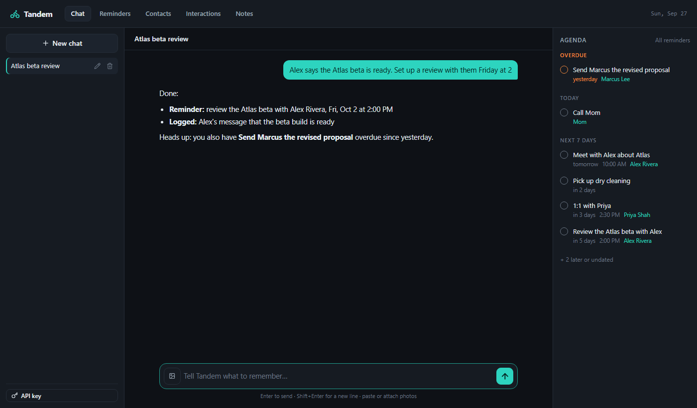
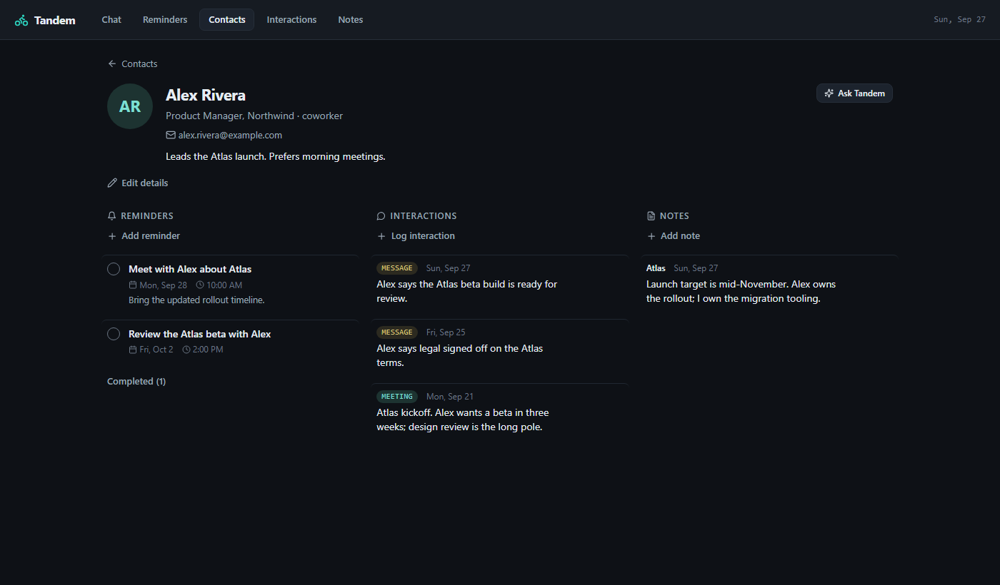
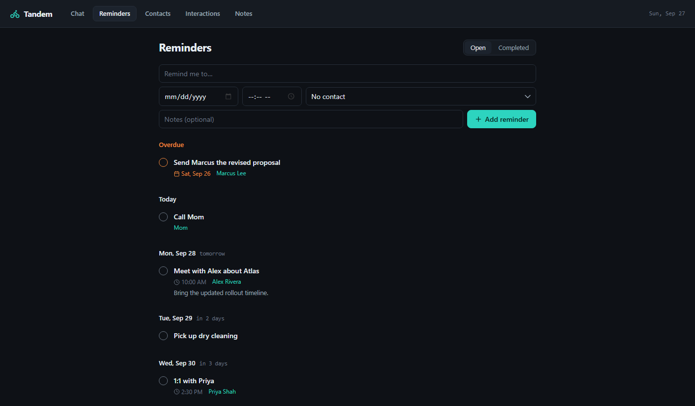

# Tandem

[](https://github.com/jwald3/Tandem/actions/workflows/ci.yml)
[](LICENSE)

Tandem is a self-hosted personal assistant. You talk to it in a chat window and
it keeps track of the people in your life and the things you need to do:
contacts, reminders, interactions and notes, all in a local SQLite file. Under
the hood it's Claude with tools for reading and writing that data.

> "I have to meet my coworker Alex Rivera Monday about Atlas."

Tandem creates the contact *Alex Rivera (coworker)* if they don't exist yet,
then adds a reminder, *Meet with Alex about Atlas*, for the coming Monday,
linked to them. Later, "what do I know about Atlas?" or "when did I last talk
to Alex?" gets answered from that data.



<table>
  <tr>
    <td></td>
    <td></td>
  </tr>
</table>

*Screenshots use the built-in demo data (`-seed-demo`). The chat reply comes
from a scripted stand-in for the API that makes the same tool calls Claude
would.*

## What it tracks

| Record | What it is | Contact |
| --- | --- | --- |
| **Contact** | A person: name, relationship (coworker, friend...), company, title, email, phone, birthday, a short "about". | — |
| **Reminder** | Something to do or attend, with an optional date and time. | optional |
| **Interaction** | Something that already happened: a meeting, call, email or message. | optional |
| **Note** | Anything worth remembering. | optional |

Reminders, interactions and notes can each be linked to one contact or to
none. A contact's page shows everything linked to them. Deleting a contact keeps
their items and just unlinks them.

## Tabs

| Tab | What it does |
| --- | --- |
| **Chat** (home) | Talk to the assistant. It can read and change everything below. An agenda panel on the right shows what's overdue, due today and due this week, and refreshes when the assistant changes something. Attach photos too, like a business card to turn into a contact. |
| **Reminders** | Add, edit, complete and delete reminders, grouped by day. Completed ones are under *Completed*. |
| **Contacts** | Search and add people. Each contact's page has their details plus their reminders, interactions and notes, with forms to add more. |
| **Interactions** | A log of meetings, calls, emails and messages, filterable by contact. |
| **Notes** | Free-form notes, filterable by contact. |

Every tab works without an API key. Only the chat needs one.

## Quick start

Requires [Go 1.25+](https://go.dev/dl/).

```sh
# Try it with fake data first (writes demo.db, leaves your real data alone):
go run . -seed-demo -db demo.db

# Or start fresh:
go run .
```

Then open <http://localhost:8090>.

To turn on the chat, click **API key** at the bottom of the chat sidebar and
paste an Anthropic API key (get one at
[console.anthropic.com](https://console.anthropic.com)). It's saved in your
local database and takes effect immediately.

To build a standalone binary:

```sh
go build -o tandem .
./tandem
```

### Docker

```sh
docker compose up -d
```

Then open <http://localhost:8090>. Data lives in the `tandem-data` volume. Set
`TZ` in `docker-compose.yml` to your timezone, since it decides what "today"
and "Monday" mean. The compose file only publishes the port to this computer;
see the security note below before changing that.

## Configuration

Set these as environment variables, or copy `.env.example` to `.env` (read on
startup; real environment variables take priority).

| Variable | Default | Purpose |
| --- | --- | --- |
| `ANTHROPIC_API_KEY` | *(unset)* | Enables the chat. If set, it overrides any key saved in the app, and the in-app key field becomes read-only. |
| `ADDR` | `127.0.0.1:8090` | Listen address. The default only accepts connections from this computer. |
| `DB_PATH` | `tandem.db` | SQLite file, created on first run. The `-db` flag overrides it. |
| `ANTHROPIC_BASE_URL` | `https://api.anthropic.com` | Where chat requests go. Only needed for a proxy or a fake API in tests. |

| Flag | Purpose |
| --- | --- |
| `-db FILE` | Database file to use (overrides `DB_PATH`). |
| `-seed-demo` | Fill an **empty** database with a few demo contacts, reminders, interactions and notes, then start. Refuses if the database already has data. |

> **Security:** there is no login. Anyone who can reach the port can read your
> data and use your saved API key. Keep the default localhost address, or put
> it behind a VPN (such as Tailscale) or a reverse proxy that adds
> authentication.

## How the assistant works

Each message runs a tool-use loop ([`internal/assistant`](internal/assistant))
on `claude-opus-5` with adaptive thinking, using the official
[Anthropic Go SDK](https://github.com/anthropics/anthropic-sdk-go). The
assistant has these tools, all backed by the local database:

| Area | Read | Write |
| --- | --- | --- |
| Contacts | `search_contacts`, `get_contact` | `create_contact`, `update_contact`, `delete_contact` |
| Reminders | `list_reminders` | `create_reminder`, `update_reminder`, `complete_reminder`, `delete_reminder` |
| Interactions | `list_interactions` | `log_interaction`, `update_interaction`, `delete_interaction` |
| Notes | `list_notes` | `add_note`, `update_note`, `delete_note` |
| Everything | `search` | |

Some details that make it dependable:

- **Contacts by name.** Tools take a contact as an id or a name. "alex",
  "al rivera" and "Rivera" all find Alex Rivera. If a name matches more
  than one person, the tool refuses and lists the candidates, so the assistant
  asks you which one you meant.
- **Dates.** Every request includes today's date and a two-week calendar
  (weekday → date), so "Monday" or "next Friday" resolves correctly. Dates and
  times are validated before anything is saved, and each confirmation repeats
  the weekday.
- **Context.** Each request also includes open reminders (overdue and the next
  7 days) and the contact list, so simple requests need no lookups.
- **Caching.** The instructions and tool definitions are prompt-cached. The
  per-day context comes after them, so it doesn't break the cache.
- **Refusal fallback.** Requests opt into server-side fallbacks
  (`fallbacks: "default"`), so if a safety classifier declines a request, a
  fallback model answers it instead of the chat failing.
- **Background replies.** Replies are generated in the background and saved
  as they finish, so reloading or leaving the page doesn't lose one. A failed
  reply gets a **Retry** button.

The cheaper `claude-haiku-4-5` writes conversation titles.

Your API key stays on your machine. The only data that leaves it is what's
sent to the Anthropic API during a chat: your messages, any photos you attach,
the context block above, and whatever the tools read to answer.

## Project layout

`main.go` only reads flags and config and wires things together. The app lives
in `internal/`, one package per concern. Dependencies point one way: `server`
and `assistant` use `store`, never the reverse.

```
main.go               entry point: flags, seed, start the server
internal/
  config/             environment and .env loading
  store/              SQLite schema and queries, one file per domain
  assistant/          the Claude tool-use loop, system prompt + live context,
                      and the tools (tools_*.go, grouped by domain)
  server/             HTTP routes and handlers, one file per tab
  markdown/           small, safe Markdown renderer for assistant replies
  seed/               -seed-demo fake data
  dates/              YYYY-MM-DD / HH:MM parsing and friendly formatting
web/
  assets.go           embeds the two folders below into the binary
  templates/          one template file per page, plus shared row partials
  static/             style.css, app.js, vendored htmx.min.js
docs/screenshots/     README images (captured from -seed-demo data)
.github/              CI workflow, issue and PR templates
```

The stack: Go standard library `net/http` and `html/template`,
[HTMX](https://htmx.org) for the chat, plain HTML forms everywhere else, and
[modernc.org/sqlite](https://pkg.go.dev/modernc.org/sqlite) (pure Go, no C
compiler needed). There is no JavaScript build step. Templates and static files
are compiled into the binary with `go:embed`, so restart after editing them.

## Development

```sh
go run . -seed-demo -db dev.db   # first run: a dev database with fake data
go run . -db dev.db              # later runs
go test ./...                    # unit tests; the assistant's loop runs against a fake API
go vet ./... && gofmt -l .       # lint; gofmt should print nothing
```

Database files are git-ignored because they hold your personal data and
possibly your API key. Don't commit them.

## Contributing

Issues and pull requests are welcome. See [CONTRIBUTING.md](CONTRIBUTING.md)
for setup, the checks CI runs, and where things live in the code. Please report
security issues privately as described in [SECURITY.md](SECURITY.md), and
follow the [Code of Conduct](CODE_OF_CONDUCT.md).

## License

MIT, see [`LICENSE`](LICENSE).
